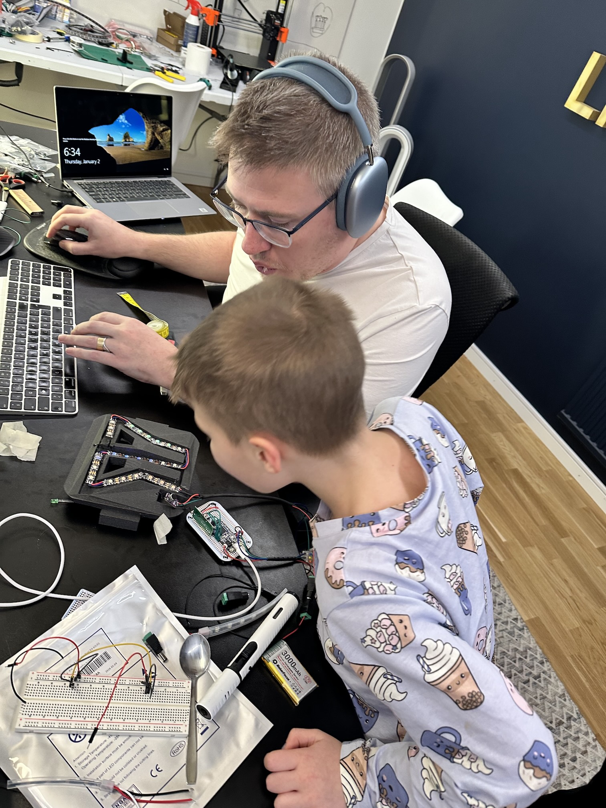
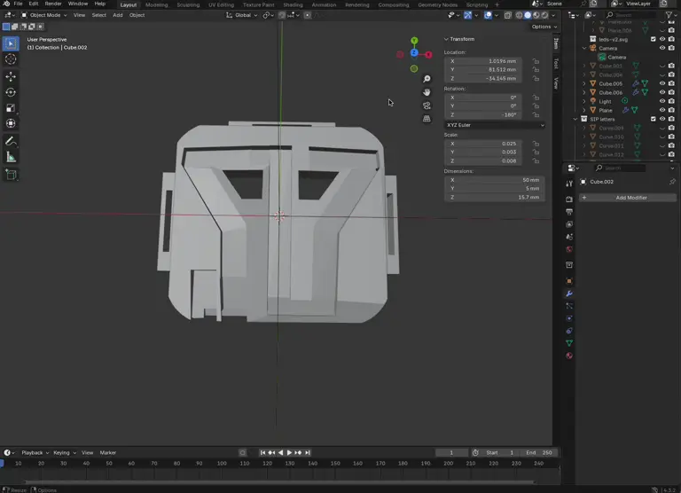

# APOC
My son loves [Smash Into Pieces](https://www.smashintopieces.com/) which is a rock band. He's especially intriqued by the drummer APOC. APOC has a pretty cool mask which lights up in different colors. There is also a [childrens book](https://www.bokus.com/bok/9789189823396/apoc-och-jakten-pa-sjalvfortroendet/) about him.
So my son wants a real-life working Apoc mask for when we go to their concert in February 2025. It needs to be stable and carry-able.

### Table of Contents
* [The project](#the-project)
* [End Result](#end-result)
* [The parts of the projects](#the-parts-of-the-project)
  * [3D printing the mask](#3d-printing-the-mask)
  * [Electronics](#electronics)
    * [Wiring diagram](#wiring-diagram)
  * [Programming the microcontroller](#programming-the-microcontroller)


My son loves [Smash Into Pieces](https://www.smashintopieces.com/) which is a rock band. He's especially intriqued by the drummer APOC. APOC has a pretty cool mask which lights up in different colors. There is also a [childrens book](https://www.bokus.com/bok/9789189823396/apoc-och-jakten-pa-sjalvfortroendet/) about him. 

Here is how he looks:

[](APOC-hero-banner-241212-1448.jpeg)

And the end result:

[](apoc-led.webp)

## The project

So my son wants a real-life working Apoc mask for when we go to their concert in February 2025. It needs to be stable and carry-able.

Breaking this down it would take us down quite the rabbit hole, ending into something like this:

[](IMG_9086.jpeg)
[](IMG_9087.jpeg)
[](IMG_9239.jpeg)

## End result

Here is my version:

[](IMG_9319.jpeg)
[](apoc-led.webp)


## The parts of the project

Drawing it up on a whiteboard I found that the project can be broken down into three parts:

1. 3D-printing the mask my son can wear
2. Electronics
3. Programming the microcontroller

As a bonus, I also wanted:

1. The ability for him to change colors
2. The ability to fade/color
3. The ability to set a brightness mode that lights brighter the higher the music is in the room

### 3D-printing the mask

I have a Prusa MK4 3D printer that I am going to use in my work. But the fact is, I haven't 3d modelled in 15 years. I started by 3d scanning his face, but quickly realised that was overkill. I use Blender 3D to model it (making the shapes in illustrator, then importing as CSV). 

Here is the evolution of the mask, from left to right:

[](IMG_9318.jpeg)

And the end result:

[](IMG_9319.jpeg)

The mask is curved, but the picture doesn't really show it. I inserted elastic bands to keep it on his head.

[](apoc.webp)

Take about 8-10 hours to 3D print.

#### Soldering the LED:s onto the mask
Actually soldering the LED:s were a bit of a nightmare. It's been a long time since I soldered, and this is pretty small. I was starting out with mini-LED strips but was simply too small, so I went with regular LED:s.

### Electronics
Here are the parts:

1. [Adafruit NeoPixel Digital RGBW LED Strip - Black PCB 60 LED/m](https://www.adafruit.com/product/2837)

2. [Adafruit Feather STM32F405 Express](https://www.adafruit.com/product/4382)

3. [Simple RF M4 Receiver - 315MHz Momentary Type](https://www.adafruit.com/product/1096) for wireless buttons. I ended up also using [fixed buttons](https://www.amazon.se/dp/B0CJ6GXM2T?ref=ppx_yo2ov_dt_b_fed_asin_title) because the range of the wireless was pretty bad. 

4. 3.7v lipo battery

5. Electronic microphone (https://www.amazon.se/dp/B08T1V3752?ref=ppx_yo2ov_dt_b_fed_asin_title&th=1)

6. [Mini DC-DC Boost (3.7v to 5v)](https://www.amazon.se/dp/B0B5R9L3R1?ref=ppx_yo2ov_dt_b_fed_asin_title)

#### Wiring diagram

Used [fritzing](https://fritzing.org/) to create the wire diagram:

[](Screenshot 2025-01-14 at 20.01.52.png)

In reality, it looks like this:

[](apoc.webp)

[](IMG_9321.jpg)


## Programming the microcontroller

The Feather runs circuitpython which makes it very simple to program it, which I prefer over Arduino. Once you flashed it, it shows up like a drive where you place a code.py file. While I use IntelliJ normally in this case I used the suggested [Mu Editor](https://codewith.mu/) since it gives me the STDOUT as well.

You basically run a loop, and for each loop I check:

1. Is a button pressed
2. Should I re-program the LED:s (*each* LED is separately programmed)

I also fade in/out the brightness slightly (to make the mask more dynamic).

The whole thing is super simple. It needs a few modules (to be placed in the lib folder on the CIRCUITPY drive), namely: adafruit_fancyled, adafruit_register, adafruit_seesaw (not currently used), neopixel

**code.py**
```
import time
import digitalio
import board
import analogio
import math
from ulab import numpy as np

import board
import neopixel

import adafruit_fancyled.adafruit_fancyled as fancy
from helpers import *

# MODES
MAX_BRIGHTNESS = 1
DYNAMIC_BRIGHTNESS = 2

FIXED_COLORS = 3
RAINBOW_COLORS = 4

# BUTTONS
# 1: Cycle between fixed colors
# 2. Toggle brightness mode
# 3. Rainbow colors

brightness_mode = MAX_BRIGHTNESS
mode = RAINBOW_COLORS

# Add pulsating effects when using fixed colors (on brightness, between 0.7 and 0.9)


NUM_LEDS = 24
pixels = neopixel.NeoPixel(board.A2, NUM_LEDS, brightness=1.0, auto_write=False, pixel_order=neopixel.RGBW)

palette = [
    fancy.CRGB(1.0, 0.0, 0.0),  # Red
    fancy.CRGB(0.5, 0.5, 0.0),  # Yellow
    fancy.CRGB(0.0, 1.0, 0.0),  # Green
    fancy.CRGB(0.0, 0.5, 0.5),  # Cyan
    fancy.CRGB(0.0, 0.0, 1.0),  # Blue
    fancy.CRGB(0.5, 0.0, 0.5),  # Magenta
]

print(palette[0])

offset = 0  # Positional offset into color palette to get it to 'spin'

print("STARTING")

current_brightness_for_max_brightness_mode = 0.7
current_brightness_increasing = True
brightness_offset = 0.005
current_fixed_color = 0

button_1_pressed = False
button_2_pressed = False
button_3_pressed = False
button_4_pressed = False

new_button_1_pressed = False
new_button_2_pressed = False
new_button_3_pressed = False
new_button_4_pressed = False

currently_button_1_pressed = False
currently_button_2_pressed = False
currently_button_3_pressed = False
currently_button_4_pressed = False

rf_pin1 = digitalio.DigitalInOut(board.D13)
rf_pin1.direction = digitalio.Direction.INPUT

rf_pin2 = digitalio.DigitalInOut(board.D12)
rf_pin2.direction = digitalio.Direction.INPUT

rf_pin3 = digitalio.DigitalInOut(board.D11)
rf_pin3.direction = digitalio.Direction.INPUT

rf_pin4 = digitalio.DigitalInOut(board.D10)
rf_pin4.direction = digitalio.Direction.INPUT

phy_pin1 = digitalio.DigitalInOut(board.D9)  # Change D5 to your pin
phy_pin1.direction = digitalio.Direction.INPUT
phy_pin1.pull = digitalio.Pull.UP

phy_pin2 = digitalio.DigitalInOut(board.D6)  # Change D5 to your pin
phy_pin2.direction = digitalio.Direction.INPUT
phy_pin2.pull = digitalio.Pull.UP

phy_pin3 = digitalio.DigitalInOut(board.D5)  # Change D5 to your pin
phy_pin3.direction = digitalio.Direction.INPUT
phy_pin3.pull = digitalio.Pull.UP

while True:
    # These are actually inversed, where the power is lower (GROUND) when switch is pressed
    # and HIGH when they are not pressed. Hence why we revert them.
    physical_pin_1_pressed = phy_pin1.value is False
    physical_pin_2_pressed = phy_pin2.value is False
    physical_pin_3_pressed = phy_pin3.value is False
    # We don't have a 4 one...
    
    # HANDLE BUTTON PRESS HERE
    button_1_pressed = rf_pin1.value or physical_pin_1_pressed
    button_2_pressed = rf_pin2.value or physical_pin_2_pressed
    button_3_pressed = rf_pin3.value or physical_pin_3_pressed
    button_4_pressed = rf_pin4.value

    if not button_1_pressed:
        currently_button_1_pressed = False
        new_button_1_pressed = False

    if not button_2_pressed:
        currently_button_2_pressed = False
        new_button_2_pressed = False

    if not button_3_pressed:
        currently_button_3_pressed = False
        new_button_3_pressed = False

    if not button_4_pressed:
        currently_button_4_pressed = False
        new_button_4_pressed = False

    if button_1_pressed:
        mode = FIXED_COLORS
        if not currently_button_1_pressed:  # New press
            current_fixed_color += 1
            if current_fixed_color > len(palette)-1:
                current_fixed_color = 0

    if button_2_pressed:
        if not currently_button_2_pressed:
            if brightness_mode == MAX_BRIGHTNESS:
                brightness_mode = DYNAMIC_BRIGHTNESS
            elif brightness_mode == DYNAMIC_BRIGHTNESS:
                brightness_mode = MAX_BRIGHTNESS

    if button_3_pressed:
        mode = RAINBOW_COLORS

    #

    if button_1_pressed:
        currently_button_1_pressed = True

    if button_2_pressed:
        currently_button_2_pressed = True

    if button_3_pressed:
        currently_button_3_pressed = True

    if button_4_pressed:
        currently_button_4_pressed = True

    # COLORS

    if mode == FIXED_COLORS:
        for i in range(NUM_LEDS):
            color = palette[current_fixed_color]
            c = rgb_to_rgbw(int(color.red * 255), int(color.green * 255), int(color.blue * 255))
            pixels[i] = c

    elif mode == RAINBOW_COLORS:
        for i in range(NUM_LEDS):
            color = fancy.palette_lookup(palette, offset + i / NUM_LEDS)
            color = fancy.gamma_adjust(color, brightness=0.99)
            c = rgb_to_rgbw(int(color.red * 255), int(color.green * 255), int(color.blue * 255))
            pixels[i] = c
        offset += 0.02  # Bigger number = faster spin

    if brightness_mode == MAX_BRIGHTNESS:
        if current_brightness_increasing:
            current_brightness_for_max_brightness_mode += brightness_offset
        else:
            current_brightness_for_max_brightness_mode -= brightness_offset

        if current_brightness_for_max_brightness_mode > 1:
            current_brightness_increasing = False

        if current_brightness_for_max_brightness_mode < 0.7:
            current_brightness_increasing = True

        pixels.brightness = current_brightness_for_max_brightness_mode

    elif brightness_mode == DYNAMIC_BRIGHTNESS:
        values = read_mic_values()

        brightness = values/2
        pixels.brightness = brightness
        pixels.show()


    pixels.show()
```

**helpers.py**
```
import time
import digitalio
import board
import analogio
import math
from ulab import numpy as np

import board
import neopixel

import adafruit_fancyled.adafruit_fancyled as fancy
def rgb_to_rgbw(ri, gi, bi):
   # Get maximum value
   t_m = max(ri, gi, bi)

   # Return black if max is 0
   if t_m == 0:
       return {'r': 0, 'g': 0, 'b': 0, 'w': 0}

   # Calculate normalized color
   multiplier = 255.0 / t_m
   h_r = ri * multiplier
   h_g = gi * multiplier
   h_b = bi * multiplier

   # Calculate whiteness
   m_max = max(h_r, h_g, h_b)
   m_min = min(h_r, h_g, h_b)
   luminance = ((m_max + m_min) / 2.0 - 127.5) * (255.0/127.5) / multiplier

   # Calculate RGBW values
   w = int(luminance)
   b = int(bi - luminance)
   r = int(ri - luminance)
   g = int(gi - luminance)

   # Clamp values between 0-255
   return (max(0, min(r, 255)),
        max(0, min(g, 255)),
        max(0, min(b, 255)),
        max(0, min(w, 255)))

# Initialize MAX4466 microphone amplifier
microphone = analogio.AnalogIn(board.A0)

# Configuration
SAMPLE_WINDOW = 0.05  # 50ms in seconds
REFERENCE_VOLTAGE = 3.7
ADC_MAX = 65535
DB_REFERENCE = 0.0006  # Adjusted reference value (20 μV)

def get_voltage(adc_value):
    return (adc_value * REFERENCE_VOLTAGE) / ADC_MAX

def read_mic_values():
    signal_max = 0
    signal_min = 65535
    start_time = time.monotonic()

    while time.monotonic() - start_time < SAMPLE_WINDOW:
        sample = microphone.value
        signal_max = max(sample, signal_max)
        signal_min = min(sample, signal_min)

    peak_to_peak_raw = signal_max - signal_min
    peak_to_peak_voltage = get_voltage(peak_to_peak_raw)
    return peak_to_peak_voltage
```
